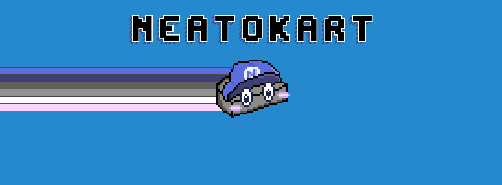
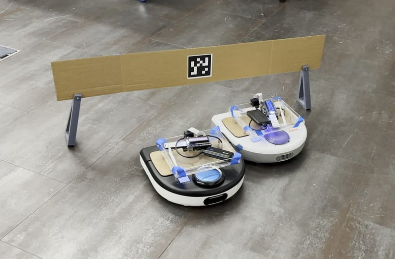
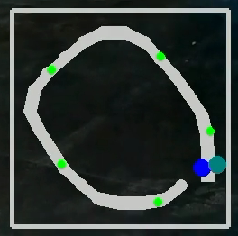
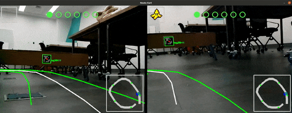
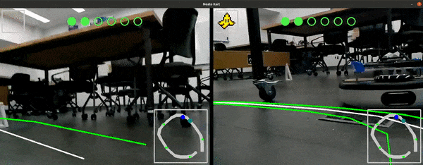
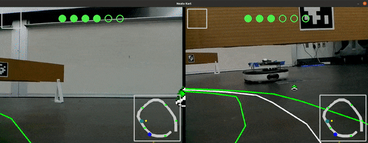
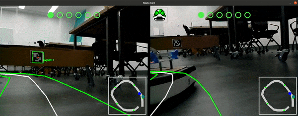
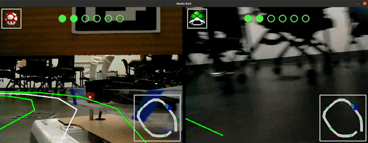

# NeatoKart



## Introduction

Inspired by Mario Kart Live: Home Circuit (2020), this project aimed to build a Neato (vacumm robot)-racing
experience that involves multiple Neatos at the same time, with users’ ability to create their
own circuits, use items during the race, and a UI that users can look at while playing the
game.

## Demo

## Run
1. Follow steps in this [page](https://comprobo22.github.io/How%20to/setup_your_environment) to set up the environment
2. Clone [neato_packages](https://github.com/SeunguLyu/neato_packages.git) in the ros2 src folder
3. Clone this repo in the ros2 src folder and build
4. Run the command to install necessary Python packages
```
pip install pygame
pip install dt-apriltags
```
### Simulation
1. Run the following command to start gazebo
```
ros2 launch neato2_gazebo neato_maze.py
```
2. Run create_map node to save a map. This step can be skipped if map already exist. For further instruction, look at "Creating Map" section
```
ros2 run neato_kart create_map
```
3. Change self.map_name in drive_neato.py to the name of the saved map. Run drive_neato node with following command
```
ros2 run neato_kart drive_neato
```
4. While drive_neato node is running, run the game_node
```
ros2 run neato_kart game_node
```

### Real World
For the real-world setup, this has been tested in specific network environment (Olin College MAC) where users can remotely connect to each Neatos that runs their nodes through network.

1. Switch to 'multiagent_support' branch in 'neato_packages' repo, after fetching the upstream repository with following command:
```
git fetch upstream
```
2. Connect to first Neato with following command, with the correct ip
```
$ ros2 launch neato_node2 bringup_multi.py host:=neato1-ip-address-here robot_name:=robot1 udp_video_port:=5002 udp_sensor_port:=7777 gscam_config:='udpsrc port=5002 ! application/x-rtp, payload=96 ! rtpjitterbuffer ! rtph264depay ! avdec_h264  ! videoconvert'
```
3. Connect to second Neato with following command, with the coorect ip
```
ros2 launch neato_node2 bringup_multi.py host:=neato2-ip-address-here robot_name:=robot2 udp_video_port:=5003 udp_sensor_port:=7778 gscam_config:='udpsrc port=5003 ! application/x-rtp, payload=96 ! rtpjitterbuffer ! rtph264depay ! avdec_h264  ! videoconvert'
```
4. Use the first Neato to create map with following command
```
ros2 run neato_kart create_map --ros-args -p robot_name:="robot1"
```
5. Change self.map_name in drive_neato.py to the name of the saved map. Run two seperate drive_neato node with following commands:
```
ros2 run neato_kart drive_neato --ros-args -p robot_name:="robot1"
```
```
ros2 run neato_kart drive_neato --ros-args -p robot_name:="robot2"
```
6. While drive_neato nodes are running, run the game_node
```
ros2 run neato_kart game_node --ros-args -p robot1_name:="robot1" -p robot2_name:="robot2"
```

## Control
1. Global
```
SPACE: Start Game
```
1. Player 1
```
W: Accelerate
S: Decelerate, Use Item Backward
A: Steer Left
D: Steer Right
L_SHIFT: Use Item
```
2. Player 2
```
UP: Accelerate
DOWN: Decelerate, Use Item Backward
LEFT: Steer Left
RIGHT: Steer Right
R_SHIFT: Use Item
```
## Guide
### Creating Checkpoints



Checkpoint can be in any dimension as far as Neato can pass under them. The only requirement is that each checkpoint should have one unique [36h11 AprilTag](https://docs.cbteeple.com/assets/files/tag36h11_100mm.pdf?fbclid=IwAR0peNEudVlSOC_sq_ZHKFJyY8_Y2BiRSEgcBE1R_nNtqmpJo2MMvEQc5Hc) attached. Preferably, the size should be around 5~15cm for better detection. Once size is determined, tag size in both drive_neato.py and create_map.py run_loop function should be changed to corresponding size:
```
results = self.detector.detect(gray, estimate_tag_pose = True, camera_params=self.camera_param, tag_size = YOUR_TAG_SIZE)
```
For convinience, we made a [3D stand model](src/NeatoKart/documents/checkpoint_stand.stl) to hold cardboard boxes. There's no limit on how many checkpoints can be used for this program, but every tag should be unique or else the game will not work properly.

### Creating Map

[](https://youtu.be/I1t8w_XXLrw)
↑ Click to view the video

The above video shows how a new map is created. It is pretty simple - run create_map node, drive a Neato through checkpoints, and save. 



The resulting map looks like above minimap. The green poins indicate checkpoints, and two big points (blue and cyan) represents the Neato's position on the map.

### Start Race

## Structure
### Multi Neato
### Map
### Items
1. Banana


2. Turtle


3. Boost

### Track
### Minimap
### AprilTag
### Checkpoints


## System architecture
ROS topic diagram, what each topic does, opencv + pygame, apriltag localization, frame transformation

## Project Stories
Story 1
Story 2
Story 3

