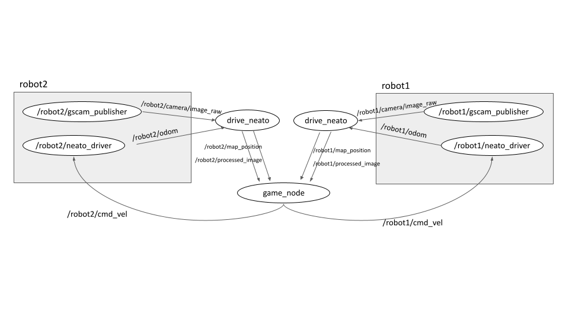

# NeatoKart


## Introduction

Inspired by Mario Kart Live: Home Circuit (2020), this project aimed to build a Neato (vacuum robot)-racing
experience that involves multiple Neatos at the same time, with users’ ability to create their
own circuits, use items during the race, and a UI that users can look at while playing the
game.

## Table of Contents
1. [Demo](#demo)
2. [Run](#run)
    1. [Simulation](#simulation)
    2. [Real World](#real-world)
4. [Control](#control)
5. [Guide](#guide)
    1. [Creating Checkpoints](#create-checkpoints)
    2. [Creating Map](#create-map)
    3. [Start Race](#start-race)
6. [Features](#features)
    1. [Map](#map)
    2. [Items](#items)
    3. [Track](#track)
    4. [Minimap](#minimap)
    5. [AprilTag and Checkpoints](#tag-and-checkpoints)
7. [System Architecture](#system)
    1. [Camera Matrix](#camera-matrix)  
    2. [Frame Transformation](#frame-transform)  
    3. [ROS Nodes](#ros-nodes)  
    4. [ROS and PyGame](#ros-pygame)  
8. [Project Stories](#project-stories)  
   

## Demo <a name="demo"></a>

[](https://youtu.be/lLSGq1WrFXU)

↑ Click to view the introduction video

[](https://youtu.be/6Exe3-IEtOo)

↑ Click to view the gameplay demo video

## Run <a name="run"></a>
1. Follow steps in this [page](https://comprobo22.github.io/How%20to/setup_your_environment) to set up the environment
2. Clone [neato_packages](https://github.com/SeunguLyu/neato_packages.git) in the ros2 src folder
3. Clone this repo in the ros2 src folder and build
4. Run the command to install the necessary Python packages
```
pip install pygame
pip install dt-apriltags
```
### Simulation <a name="simulation"></a>
1. Run the following command to start the gazebo
```
ros2 launch neato2_gazebo neato_maze.py
```
2. Run the create_map node to save a map. This step can be skipped if the map already exists. For further instruction, look at the "Creating Map" section
```
ros2 run neato_kart create_map
```
3. Change self.map_name in drive_neato.py to the name of the saved map. Run the drive_neato node with the following command
```
ros2 run neato_kart drive_neato
```
4. While the drive_neato node is running, run the game_node
```
ros2 run neato_kart game_node
```

### Real World <a name="real-world"></a>
For the real-world setup, this has been tested in a specific network environment (Olin College MAC) where users can remotely connect to each Neatos that runs their nodes through the network. For further information on how this environment is set up, go to this [website](https://comprobo22.github.io/) and look at the "Teaching Team Documentation" section.

1. Switch to the 'multiagent_support' branch in the 'neato_packages' repo, after fetching the upstream repository with the following command:
```
git fetch upstream
```
2. Connect to first Neato with the following command, with the correct IP
```
ros2 launch neato_node2 bringup_multi.py host:=neato1-ip-address-here robot_name:=robot1 udp_video_port:=5002 udp_sensor_port:=7777 gscam_config:='udpsrc port=5002 ! application/x-rtp, payload=96 ! rtpjitterbuffer ! rtph264depay ! avdec_h264  ! videoconvert'
```
3. Connect to the second Neato with the following command, with the correct IP
```
ros2 launch neato_node2 bringup_multi.py host:=neato2-ip-address-here robot_name:=robot2 udp_video_port:=5003 udp_sensor_port:=7778 gscam_config:='udpsrc port=5003 ! application/x-rtp, payload=96 ! rtpjitterbuffer ! rtph264depay ! avdec_h264  ! videoconvert'
```
4. Use the first Neato to create a map with the following command
```
ros2 run neato_kart create_map --ros-args -p robot_name:="robot1"
```
5. Change self.map_name in drive_neato.py to the name of the saved map. Run two separate drive_neato nodes with the following commands:
```
ros2 run neato_kart drive_neato --ros-args -p robot_name:="robot1"
```
```
ros2 run neato_kart drive_neato --ros-args -p robot_name:="robot2"
```
6. While drive_neato nodes are running, run the game_node
```
ros2 run neato_kart game_node --ros-args -p robot1_name:="robot1" -p robot2_name:="robot2"
```

## Control <a name="control"></a>
Global

```
SPACE: Start the Game
```

Player 1

```
W: Accelerate
S: Decelerate, Use Item Backward
A: Steer Left
D: Steer Right
L_SHIFT: Use Item
```

Player 2

```
UP: Accelerate
DOWN: Decelerate, Use Item Backward
LEFT: Steer Left
RIGHT: Steer Right
R_SHIFT: Use Item
```
## Guide <a name="guide"></a>
### Creating Checkpoints <a name="create-checkpoints"></a>


Checkpoints can be in any dimension as far as Neato can pass under them. The only requirement is that each checkpoint should have one unique [36h11 AprilTag](https://docs.cbteeple.com/assets/files/tag36h11_100mm.pdf?fbclid=IwAR0peNEudVlSOC_sq_ZHKFJyY8_Y2BiRSEgcBE1R_nNtqmpJo2MMvEQc5Hc) attached. Preferably, the size should be around 5~15cm for better detection. Once the size is determined, the tag size in both drive_neato.py and create_map.py run_loop function should be changed to the corresponding size:
```
results = self.detector.detect(gray, estimate_tag_pose = True, camera_params=self.camera_param, tag_size = YOUR_TAG_SIZE)
```
For convenience, we made a [3D stand model](documents/model/checkpoint_stand.stl) to hold cardboard boxes. There's no limit on how many checkpoints can be used for this program, but every tag should be unique, or else the game will not work properly.

### Creating Map <a name="create-map"></a>

[](https://youtu.be/I1t8w_XXLrw)
↑ Click to view the map create demo video

The above video shows how a new map is created. It is pretty simple - run create_map node, click the OpenCV screen, drive a Neato through checkpoints, and click the OpenCV screen again to save. 


[Saved File From This Drive](maps/example_map.json)

The resulting map looks like the above minimap. The green points indicate checkpoints, and two big points (blue and cyan) represent Neato's position on the map.

### Start Race <a name="start-race"></a>


To start the game, there are required conditions to not have errors:

1. Both drive_neato nodes should be running with the correct robot name parameter
2. Both Neatos should have detected the first April Tag and see the track on the screen
3. When Neato move, the camera feed is updated in real-time

If all these conditions are met, you are safe to press the SPACE button and start the game! It is important to pass checkpoints in the order that the map was recorded, or else the game will not be able to detect the end condition. Once a player goes through all the checkpoints by order, the game ends.

## Features <a name="features"></a>
### Map <a name="map"></a>

The Map is a user-created circuit that Neatos races on. It is created by running the create_map node, and the saved JSON file is used in drive_neato, and game_node so that Neato's know which map to localize themself into. 

Even though it sounds complicated, the map is just defined as a list of points and tags that are relative to the map's origin. The map's origin is set as (x:0, y:0, theta:0) and every point/tag in the map has (x, y, theta) values from that origin. When the tag is recorded, an indication that the point is a tag and the tag id is saved too.

Origin and each point are computed by the Neato's pose in the Odom frame at the time point were recorded. When the map recording starts, Neato's pose at the time is set as the map origin, and every other point as Neato moves can be computed through the following math:

> $T_{(point, origin)} = T^ {-1} _ {(origin, odom)} • T_{(point, odom)}$

Later when the map is loaded by the Neato looking at the April Tags, the map's origin will be updated in the Odom frame in real-time based on the detected tag position so that the whole map can be updated at the same time.

```json
{"x": 0.5264, "y": 0.0022, "theta": 0.0040, "istag": false, "tagid": 0}
```
Every point/tag will be saved in the above JSON format and will be loaded as a MapPoint object.

```python
class MapPoint():
    '''
    Convenient class to save a Pose in the 2D frame and convert that into different forms such as transformation matrix and dictionary.
    '''
    def __init__(self, x=0.0, y=0.0, theta=0.0, istag = False, tagid = 0):
        self.x = x
        self.y = y
        self.theta = theta
        self.istag = istag
        self.tagid = tagid
```
MapPoint object is a class that helps convert a 2D pose from/to a transformation matrix or dictionary so that it can be used by multiple functions. This object is used as a base for every frame transformation in this project.

### Items <a name="items"></a>
1. Banana


The banana will stay in the map's position where the user first used the item. Any user that steps on it will be rotating at the same position for a certain amount of seconds.

2. Turtle Shell


The turtle shell will move in the direction of the angle at which it was first created. Any user that is hit by the turtle will be rotating at the same position for a certain amount of seconds.

3. Boost


Boost will raise the Neato's speed by 20% for 5 seconds. 

### Track <a name="track"></a>

One key feature to add to NeatoKart’s AR game experience is the track generation in our real environment. There are three lines that compose the tracks in the gameplay: two green lines drawn to show the outertrack and the innertrack, and one white line to show the centertrack. 

Generating the centertrack is simple—since we already have the points that form the track in base_link frame, each of the points just needs to be converted from base_link frame → camera frame → pixel coordinates. 

Before talking about how the outer and the innertracks are generated, it is important to note that each of the points that form the track is a pose, meaning that they are a frame by themselves. Given this information, we can create a set of points for the outertrack and the innertrack for every centertrack point by dotting a displacement matrix.

$outer/inner \text{ } track point = (centertrack \text{ } point \text{ } as \text{ } matrix) * (displacement \text{ } matrix)$

After the points have been converted to the camera frame, they can then be converted to pixel coordinates by dotting the camera intrinsic matrix with the points themselves. The values for the [camera intrinsic matrix](https://github.com/SeunguLyu/NeatoKart/blob/main/neato_kart/create_track.py#:~:text=%23%20camera%20intrinsics-,self.K,-%3D%20np.) has been calculated through camera calibration. 

When converting camera_frame points to pixel coordinates, we make sure to exclude coordinates with -z values, as they correspond to points that lie behind Neato’s field of view. Without this filter, the track would be incorrectly drawn during the gameplay. Because this filter eliminates some of the points that consist of the track, we chose to draw the track line by line, formed by a set of two consecutive pixel coordinates. Further detail on the camera frame → pixel coordinates transformation is given in [camera matrix](#camera-matrix).

### Minimap <a name="minimap"></a>


Minimap is a tool to check the condition of what is happening in the game and the current map. The minimap will draw the whole map on a small scale, and show the locations of the checkpoints, items, and players. The minimap is updated in real-time based on the pose data of each Neatos in the Map frame.

Minimap is created based on the MapPoints loaded by a saved JSON file. One important aspect is resizing the map so that it can fit into the size of the minimap. The code to resize the minimap based on its shape is written [here](https://github.com/SeunguLyu/NeatoKart/blob/cd0da6d8b62255f77d26d52316ad13e4a6b0ccaa/neato_kart/game_node.py#L651), where map_multiplier is set so that longer side (x or y) will be the same as the map size. For example, if the x side was 10m and y side was 5m and the minimap size is 200 pixels, the map multiplier will be 20 so that minimap does not exceed the boundaries (then the x side will be 200 pixels, the y side is 100 pixels, thus does not exceed the minimap boundaries)

### AprilTag and Checkpoints <a name="tag-and-checkpoints"></a>


Checkpoints are an essential feature of the game to check the progress of each Neatos. Checkpoints have attached April Tag with a unique tag id, which is mainly used for robot localization. We also implemented a way to detect Neato passing the checkpoint to figure out the race progress and give items to the user. Checkpoints serve several different purposes:

1. Update the Map frame position in the Odom frame. Because errors can happen easily between the real position of the Neato and the Odom frame, there must be a way to calibrate these errors. Having multiple checkpoints help the user to localize themself in the Map frame due to frequent updating.
2. By checking that the user is passing by checkpoints in order, we can define the winning condition for this game as "The first user who passed all the checkpoints and come back to the first checkpoint"
3. To ensure that there is still a chance for the losing player to win, items are given to each user every time they pass by the checkpoint. 

## System architecture <a name="system"></a>

### Camera Matrix <a name="camera-matrix"></a>


Given a pose in the camera frame, that pose can be converted to pixel coordinates with the computation below:

```math
\begin{bmatrix}P_x\\P_y\\z\end{bmatrix} = \begin{bmatrix}f_x & 0 & c_x\\0 & f_y & c_y\\0 & 0 & 1\end{bmatrix} \cdot \begin{bmatrix}x\\y\\z\end{bmatrix}
```
```math
\begin{bmatrix}P_x\\P_y\\z\end{bmatrix} = \begin{bmatrix}f_x \times x + z \times c_x\\f_y \times y + z \times c_y\\z\end{bmatrix}
```
```math
\begin{bmatrix}P_x\\P_y\\1\end{bmatrix} = \begin{bmatrix} \frac{f_x \times x}{z} + c_x\\\frac{f_y \times y}{z} + c_y\\1\end{bmatrix}
```
The values of that form the camera intrinsic matrix is retrieved from [camera calibration](https://navigation.ros.org/tutorials/docs/camera_calibration.html).

When normalizing the pixel coordinates based on the $z$ value, we needed to make sure to deal with the case when a $-z$ value would flip the $P_x, P_y$ that is supposed to be out of the Neato's field of view (since the negative signifies that the point lies behind the Neato), since if $P_x, P_y$ is negative when $z$ is negative as well, that point will appear in the Neato's field of view (since the point value becomes positive).

### Frame Transformation <a name="frame-transform"></a>
The relevant frames used in this project are the following: map frame, Odom frame, base_link frame, camera frame, and April Tag frame. Transitions between the aforementioned frames can be represented by the diagram below, and each transition is further discussed after that. 


1. 
    The frame transformation from a tag in the camera frame to a tag in the base_link frame can be given by the equation below, where $T_ {(cam, bl)}$ indicates the transformation matrix from the *camera frame* to *base_link frame*.

    > $T_{(tag, bl)} = T_ {(cam, bl)} • T_{(tag, cam)}$

    [Example](https://github.com/SeunguLyu/NeatoKart/blob/95395af0a994e4705739a54bc36191b761b9df84/neato_kart/detect_april_tag.py#L73)

    The above equation is used to determine the distance and angle of the tag from Neato's base_link. The transformation matrix from the tag frame to the base_link frame has all the translation/angle information needed.

    Because the camera is attached to the Neato at a fixed displacement in the *x*, *y*, *z* direction, and because we know the rotation between them, we can measure those displacements to come up with a transformation matrix from the *camera frame* to *base_link frame*.

    

    Often to draw objects in the game display, the opposite was done to find the pose of the object in the camera frame from the pose of the object in the base_link frame. The frame transformation from a pose in the *base_link frame* and to a pose in the *camera frame* is performed by applying the inverse of $T_ {(cam, bl)}$:

    > $P_{cam} = T^ {-1} _ {(cam, bl)} • P_{bl}$

    [Example](https://github.com/SeunguLyu/NeatoKart/blob/95395af0a994e4705739a54bc36191b761b9df84/neato_kart/create_track.py#L135)

2. 
    From the tag to base_link transformation, it is possible to localize the Neato's position relative to the tag's position. Since we know the relationship between base_link - Odom frame (from subscribing to the robot's Odom topic), map_origin - tag frame (from the saved map data), and tag - base_link frame (from the above computation), it is possible to get the map_origin - Odom frame relationship, meaning that we can get the pose of the map's origin in the Odom frame. 

    > $T_{(origin, odom)} = T_ {(bl, odom)} • T_{(tag, bl)} • T^ {-1} _ {(tag, origin)}$

    [Example](https://github.com/SeunguLyu/NeatoKart/blob/023f219b50c44a275cd6b32074b36a045acaa2fe/neato_kart/drive_neato.py#L173)

3. 
    Since we know the relationship between the map's origin - Odom frame, we can now figure out all the points and tags pose from the map in the Odom frame. This process is useful, as, in the situation where Neato cannot update the map's origin, Neato will still have a close estimate of all the points in the map since it will be saved as pose inside the Odom frame, and the Neato will keep getting its position updated from the robot's odom topic.
    
    > $T_{(point, odom)} = T_ {(origin, odom)} • T_{(point, origin)}$
    > $T_{(tag, odom)} = T_ {(origin, odom)} • T_{(tag, origin)}$

    [Example](https://github.com/SeunguLyu/NeatoKart/blob/023f219b50c44a275cd6b32074b36a045acaa2fe/neato_kart/drive_neato.py#L193)

4. 
    To draw tracks relative to Neato, it is important to figure out the relationship between Neato and the pose of points from the map. Since we know the transformation from point to Odom =frame and transformation from base_link to Odom frame, it can be easily computed.

    > $T_{(point, bl)} = T^ {-1} _ {(bl, odom)} • T_{(point, odom)}$

    [Example](https://github.com/SeunguLyu/NeatoKart/blob/023f219b50c44a275cd6b32074b36a045acaa2fe/neato_kart/drive_neato.py#L215)
    
5. 
    Finally, to process the Neato's position in the minimap, and figure out if Neato is colliding with items that are located inside the map frame, it is required to know the transformation from base_link to map_origin. This is done every time node receives a message from the odometry topic, to give the accurate position as possible to the game node. 

    > $T_{(bl, origin)} = T^ {-1} _ {(origin, odom)} • T_{(bl, odom)}$

    [Example](https://github.com/SeunguLyu/NeatoKart/blob/023f219b50c44a275cd6b32074b36a045acaa2fe/neato_kart/drive_neato.py#L111)

### ROS Nodes <a name="ros-nodes"></a>



1. Drive Neato (topics processed images, neato position) subs pubs

    **/drive_neato** is **subscribed** to two topics:
    1. The raw image topic (*/robot2/camera/image_raw*) that is published by gscam_publisher node from robot2.
    2. The odom topic (*/robot2/odom*) that is published by the neato_driver node from robot2.

    **/drive-neato** then **publishes** to two topics:
    1. The map_position topic (*/robot2/map_position*) to the */game_node*. This indicates robot2’s position in the map frame.
    2. The processed_image topic (*/robot2/processed_image*) to the */game_node*. This image contains all the OpenCV graphics that contain the visual components of the track.
    
2. Game Node receives the info subs pubs diagram

    **/game_node** is **subscribed** to two topics:
    The */robot2/map_position* and */robot2/processed_image* mentioned above.

    **/game_node** then **publishes** to topics:
    The */robot1/cmd_vel* and */robot2/cmd_vel* controls velocity of two robots.

### ROS and PyGame <a name="ros-pygame"></a>

Integrating PyGame with ROS2 was very successful, as it achieved three major goals:

1. Retrieve multiple key inputs from the user and process them real-time
2. Provide an easy way to create a UI with less computation
3. Provide a way to give sound feedback to the user.

For people who are looking for a game-like experience involving robots, we can highly recommend integrating ROS and PyGame. 

## Project Stories <a name="project-stories"></a>
[Project Story 1](documents/project_story_1.pdf)

[Project Story 2](documents/project_story_2.pdf)